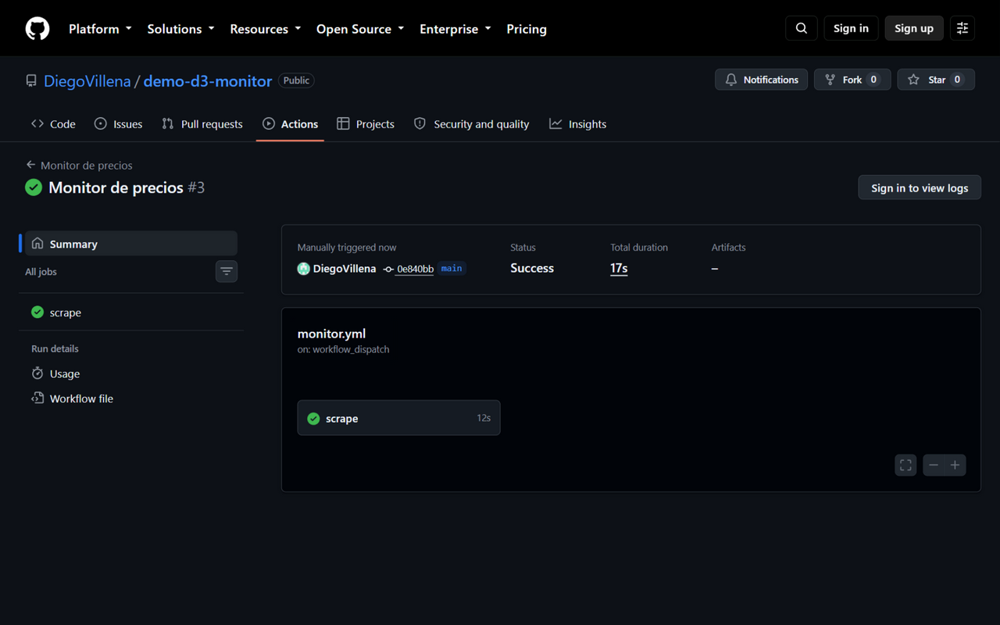

# Monitor de precios de libros — Librería Meridiana (demo D3)

> **⚠️ Negocio 100% FICTICIO.** "Librería Meridiana" es una empresa inventada, creada
> como demostración de portafolio (*demo D3* de **Operación Freelancer**, servicio S3:
> *"montamos el monitor de precios que corre solo y deja la serie histórica"*). Ni la
> librería ni sus vigilancias de competidores existen. Los datos vienen de un cliente
> real de otro mundo: **books.toscrape.com**, un sitio público creado expresamente
> para **practicar scraping** — en concreto su categoría *Fiction* (65 títulos).
> Precios y valoraciones de ese sitio son falsos (y estáticos).




Un scraper que vigila los precios de una categoría de libros, **una vez al día**,
y va dejando la serie histórica en este mismo repo, en `data/prices.csv`. GitHub
Actions lo ejecuta todos los días a las ~07:00 UTC (también con botón manual) y
commitea el CSV **solo si cambió**. Cero claves, cero servidores: el repo es el
producto.

```console
$ python scraper.py
Monitor de precios (demo D3) — 2026-10-05
  categoría: http://books.toscrape.com/catalogue/category/books/fiction_10/index.html
  páginas vistas: 4
  libros vistos: 65
  filas añadidas hoy: 65
  total filas del CSV: 65 (data/prices.csv)
```

## La serie histórica crece cada día

El valor del monitor no está en la corrida de hoy — está en el histórico: cada día
el Cron añade **65 filas** (una por título y día), y el CSV del repo crece solo.
Ese archivo es la entrega del servicio S3: la serie con la que el cliente analiza
tendencias. Al quinto día hay 325 filas; al mes, ~1.950.

Las primeras filas del CSV (reales, del día 1):

| fecha | titulo | precio_gbp | rating | disponible |
|---|---|---:|---:|---|
| 2026-10-05 | Soumission | 50.1 | 1 | In stock |
| 2026-10-05 | Private Paris (Private #10) | 47.61 | 5 | In stock |
| 2026-10-05 | We Love You, Charlie Freeman | 50.27 | 5 | In stock |
| 2026-10-05 | Thirst | 17.27 | 5 | In stock |

*Nota honesta: en el sitio de práctica los precios son estáticos, así que la serie
es plana — pero la mecánica (serie creciendo, idempotencia, commit automático) es
idéntica a la que correría apuntando a una tienda real, donde los precios sí se
mueven. La serie de este repo ya lleva 2 días: 130 filas.*

## Qué hace esta demo

| Fase | Detalle |
|---|---|
| **1. Scrape amable** | Categoría *Fiction* de books.toscrape.com (4 páginas), con User-Agent identificativo y ~0,7 s de pausa entre páginas. |
| **2. Parse** | De cada libro: título, precio (£ → `precio_gbp`), rating (1-5 desde la clase CSS), disponibilidad y URL de su ficha. |
| **3. Append idempotente** | `data/prices.csv`: una fila por (título, día UTC). Re-corrida el mismo día → **0 filas duplicadas**. |
| **4. Commit automático** | GitHub Actions commitea el CSV solo si cambió, con el `GITHUB_TOKEN` estándar (permiso `contents: write` del propio workflow — **cero claves externas**). |
| **5. Programación** | `workflow_dispatch` (botón "Run" para probar HOY) + cron diario `0 7 * * *`. |

**Entregas "de serie" (la diferencia del servicio S3):**

- **Idempotencia**: una fila por título y día — el Actions puede correr dos veces
  el mismo día (manual + cron) sin duplicar.
- **Tests offline** (pytest): parsean un fixture HTML local guardado una sola vez;
  **ningún test lanza peticiones de red**.
- **Cero secretos**: solo el `GITHUB_TOKEN` estándar; nada que rote ni se fugue.
- **Scraping respetuoso**: UA identificativo, 1 pasada diaria, pausa entre páginas,
  sin reintentos agresivos — ver declaración de robots/ética más abajo.

## Stack

[Python 3.11](https://www.python.org) · [requests](https://requests.readthedocs.io) ·
[beautifulsoup4](https://www.crummy.com/software/BeautifulSoup/bs4/doc/) ·
[pytest](https://docs.pytest.org) — versiones **EXACTAS** fijadas en
[`requirements.txt`](requirements.txt) · CSV con la stdlib (sin pandas) ·
[GitHub Actions](https://github.com/features/actions) para la parte programada.

## Cómo correrlo

```bash
python -m venv venv              # primera vez
source venv/Scripts/activate     # Windows Git Bash · en Linux/macOS: venv/bin/activate
pip install -r requirements.txt  # primera vez

python scraper.py                # scrapea la categoría y añade el día al CSV
pytest                           # tests — parse + idempotencia, sin red
```

## Estructura

```text
demo-d3-monitor/
├── .github/workflows/monitor.yml  ← el monitor programado (dispatch + cron 07:00 UTC)
├── scraper.py                     ← scrapea la categoría y hace el append idempotente
├── requirements.txt               ← pins exactos: requests · beautifulsoup4 · pytest
├── tests/
│   ├── fixtures/fiction-p1.html   ← recorte real de una página del sitio (1 fetch, 1 vez)
│   └── test_scraper.py            ← parse del fixture + idempotencia del CSV
├── data/prices.csv                ← la serie histórica: crece cada día (commiteado)
├── DOC-USO.md                     ← guía de 1 página: leer el CSV, cambiar de categoría
└── docs/capturas/                 ← capturas de este README (corrida verde del Actions)
```

Lo único que cambia de un cliente a otro vive en las constantes de arriba de
`scraper.py` (`CATEGORIA_URL`, pausa, User-Agent) — **[DOC-USO.md](DOC-USO.md)** explica cómo.

## Robots y ética

- **El objetivo**: [`books.toscrape.com`](https://books.toscrape.com) es un
  **sitio construido para practicar scraping** (declarado en su portada) — es un
  uso legítimo y deseado por el propio site.
- **robots.txt**: el sitio **no publica robots.txt** (la petición devuelve HTTP
  404 — no hay reglas que verificar). Aun así aplicamos praxis de buena vecindad:
  User-Agent identificativo, 1 pasada diaria, ~0,7 s entre páginas y cero
  reintentos agresivos.
- Sin proxies ni anti-bloqueo, sin scraping paralelo: 4 peticiones cada 24 horas.

## Estado

Demo de fase A terminada: la corrida manual del Actions está **en verde y sin
avisos** (la foto de arriba —
[run #3](https://github.com/DiegoVillena/demo-d3-monitor/actions/runs/37485504665),
con `checkout`/`setup-python` v7 y runner `ubuntu-24.04` fijo), y el monitor corre cada día a las ~07:00 UTC: el badge de arriba muestra el estado
de la última ejecución, y el bot `github-actions[bot]` commitea el CSV cada día
que la serie crece. Alcance congelado según ficha — fuera de alcance: Google Sheet en
vivo y alertas por email (**fase B, ficha aparte**), cualquier otro sitio,
dashboards y GUI. Es la tercera demo de **Operación Freelancer** (D1
[web de clínica](https://github.com/DiegoVillena/demo-d1-web-clinica), D2
[informe automático de ventas](https://github.com/DiegoVillena/demo-d2-informe)).